# Curve fitting

## Theory

### 1. Polynomial Curve Fitting to Linear Regression
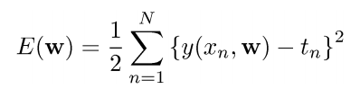

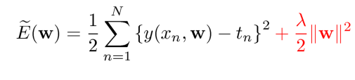

### 2. Minimum-Squared Error 

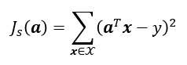

Using matrix notation for convenience

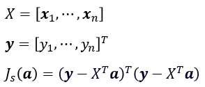

### 3. Optimizing the MSE Criterion
Computing the gradient gives

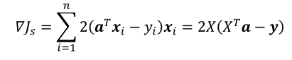

Setting the gradient to zero

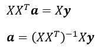
### 4. Regulization
The solution for *a* can be obtained uniquely if *XXT* is non-singular. We can use ridge regression.

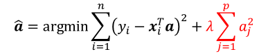

The unique solution:

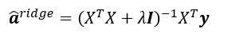

## Program results

Sample the function curve of y=sin(x) with Gaussian noise. The blue curve is the origin curve and the green one is the polynomial fitting curve.

* fit degree 3 curves in 10 samples

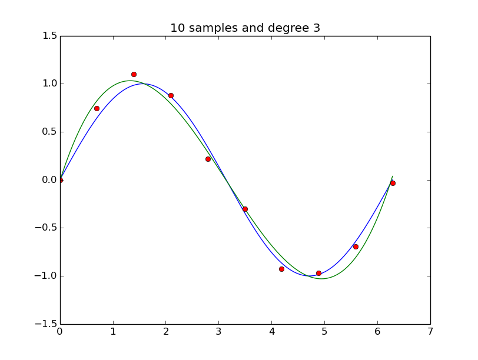

* fit degree 9 curves in 10 samples

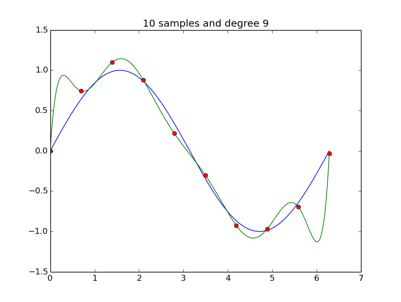

* fit degree 9 curves in 15 samples

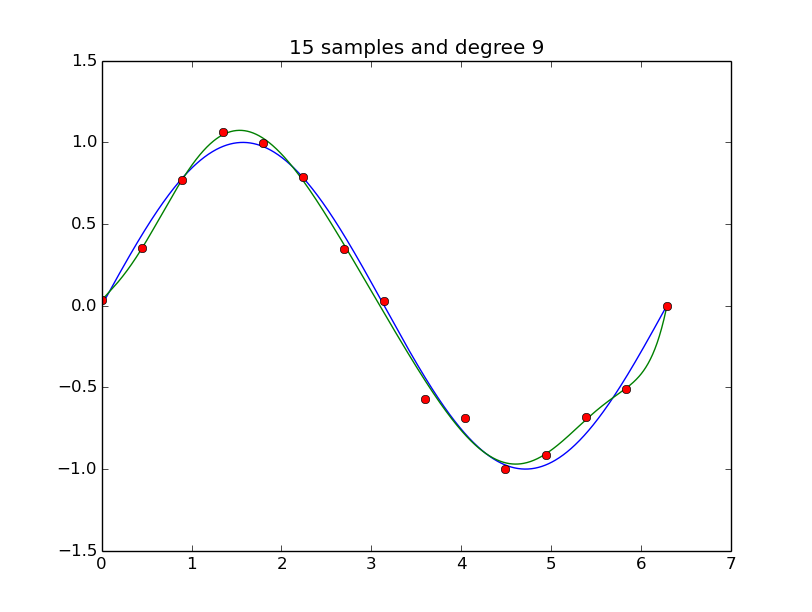

* fit degree 9 curves in 100 samples

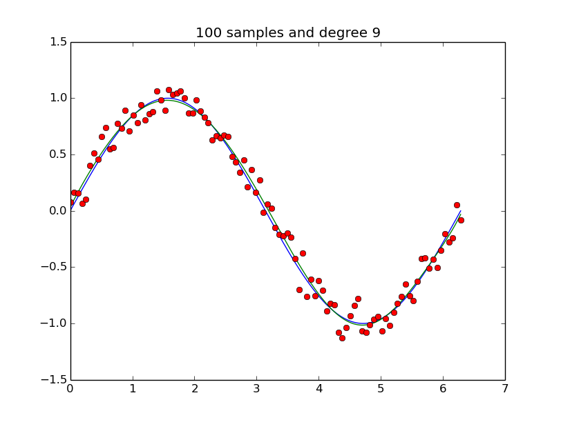

* fit degree 9 curves in 10 samples with regularization

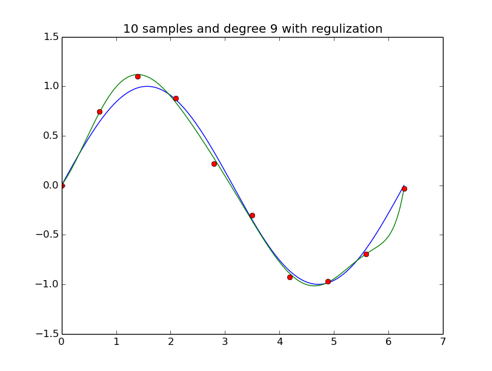

