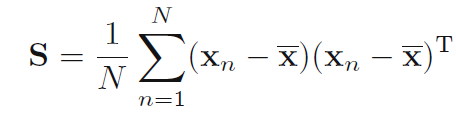

# PCA

## Theory

Consider a data set of observations *{xn}* where *n = 1, ..., N*, and *xn* is a
Euclidean variable with dimensionality *D*. Our goal is to project the data onto a space having dimensionality *M &lt; D* while maximizing the variance of the projected data.

To begin with, consider the projection onto a one-dimensional space (*M = 1*). We can define the direction of this space using a *D*-dimensional vector *u1*, which for convenience (and without loss of generality) we shall choose to be a unit vector so that *u1T**u1 = 1*(note that we are only interested in the direction defined by *u1*, not in the magnitude of *u1* itself). Each data point *xn* is then projected onto a scalar value *u1T**xn*. The sample set mean given by

and the variance of the projected data is given by

where ***S*** is the data covariance matrix defined by

We now maximize the projected variance *u1T**Su1* with respect to *u1*. The appropriate constraint comes from the normalization condition *u1T**u1 = 1*. To enforce this constraint, we introduce a Lagrange multiplier, and then make an unconstrained maximization of

By setting the derivative with respect to *u1* equal to zero, we see that this quantity will have a stationary point when

and so the variance will be a maximum when we set *u1* equal to the eigenvector having the largest eigenvalue. This eigenvector is known as the first principal component.

We can define additional principal components in an incremental fashion by choosing each new direction to be that which maximizes the projected variance amongst all possible directions orthogonal to those already considered. If we consider the general case of an *M*-dimensional projection space, the optimal linear projection for which the variance of the projected data is maximized is now defined by the *M* eigenvectors of the data covariance matrix **S** corresponding to the *M* largest eigenvalues
## Test data

The original data set is from [Optical Recognition of Handwritten Digits Data Set](http://archive.ics.uci.edu/ml/datasets/Optical+Recognition+of+Handwritten+Digits).
 
I changed the data a little bit for convience and use two files -- *optdigits-tra-comp.cv* and *optdigits-tra-orig.cv*.

**optidgits-tra-comp.cv**: It is the data set for training  which contains 3823 samples with compression. It is optdigits.tra removing its head information.

**optdigits-tra-orig.cv**: It is the data set for generating images. The full data is consisited of these data set and all head information are removed.

 * line 1-1934: optdigit-orig.tra
 * line 1935-2880: optdigit-orig.cv
 * line 2881-3823: optdigit-orig.wedp

## Program results

The digit can be chosen in function *choose_num*

* perform PCA over all digit '3' with 2 components

* perform PCA over all digit '6' with 2 components

## Reference

Bishop C M. Pattern Recognition and Machine Learning (Information Science and Statistics)[M]. Springer-Verlag New York, Inc. 2006.