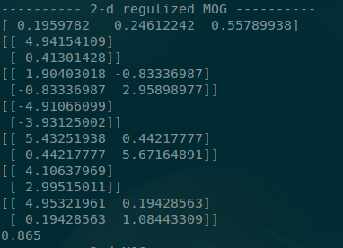

# 2D MOG and EM algorithm

## Theory

## Test data

### 2D MOG

<table>
	<tr>
        <td>Model</td><td>Mean</td><td>Covariance</td><td>Number</td>
    </tr>
	<tr>
        <td>1</td><td>[5,1]</td><td>[ [1, 2], [2, -4] ]</td><td>100</td>
    </tr>
	<tr>
        <td>2</td><td>[-5,-4]</td><td>[ [5, 0], [0, 5] ]</td><td>100</td>
    </tr>
	<tr>
        <td>3</td><td>[4,3]</td><td>[ [5, 0], [0, 1] ]</td><td>200</td>
    </tr>
</table>

### 3D MOG

<table>
	<tr>
        <td>Model</td><td>Mean</td><td>Covariance</td><td>Number</td>
    </tr>
	<tr>
        <td>1</td><td>[-5,1,1]</td><td>[ [1, 0, 0], [0, 1, 0], [0, 0, 1] ]</td><td>100</td>
    </tr>
	<tr>
        <td>2</td><td>[-5,-4,2]</td><td>[ [2, 0, 0], [0, 1, 0],[0, 0, 2] ]</td><td>200</td>
    </tr>
</table>

## Program results

This program implement MOG in n-D case and add regularization term in EM algorithm.

Output of program:

* The proportion of MOG
* Mean
* Covariance
* The accuracy of clustering

 
### 2D MOG 

result without regularization, the accuracy is 0.8625.

result with regularization, the accuracy is 0.865.

plot the clustering of 2-d data set

### 3D MOG 

the accuracy is 1.

## Reference

Bishop C M. Pattern Recognition and Machine Learning (Information Science and Statistics)[M]. Springer-Verlag New York, Inc. 2006.