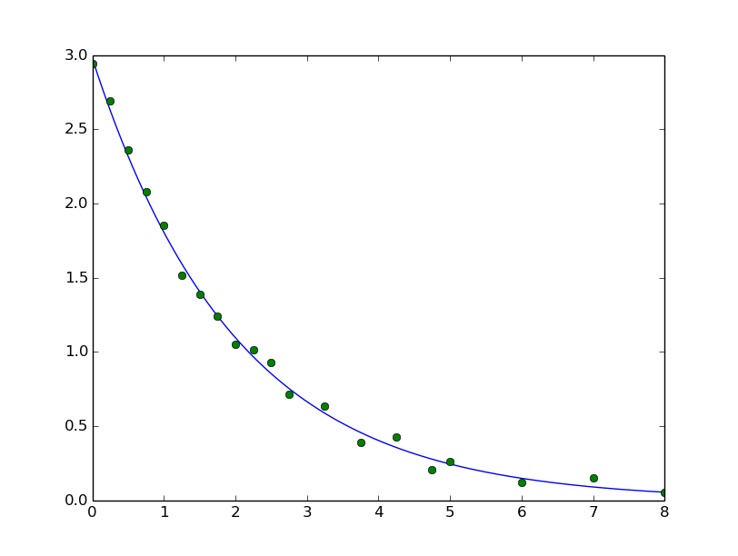

# Levenberg-Marquardt algorithm

## Theory

## Test data

The *testData.txt* contains data computed by *y = 3exp(-0.5x)* with some noises.

## Program results

* Output of program(the orgin parameters are *a = 3* and *b = 0.5*):

* Plot of test data and computed function

## Reference

Madsen K, Nielsen H B, Tingleff O. Methods for Non-Linear Least Squares Problems (2nd ed.)[J]. Siam J Optim, 2004, 16(1):487–490.