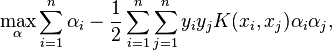
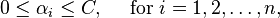
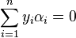
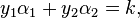
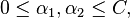
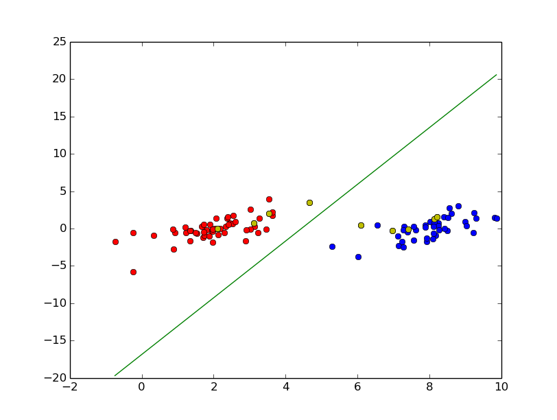

# SVM with SMO

## Theory

(This is from wikipedia)

### Optimization problem

Consider a binary classification problem with a dataset *(x1, y1), ..., (xn, yn)*, where xi is an input vector and *yi* belongs to *{-1, +1}* is a binary label corresponding to it. A soft-margin support vector machine is trained by solving a quadratic programming problem, which is expressed in the dual form as follows:

subject to:

where *C* is an SVM hyperparameter and *K(xi, xj)* is the kernel function, both supplied by the user; and the variables *ai* are Lagrange multipliers. 

### SMO Algorithm

SMO is an iterative algorithm for solving the optimization problem described above. SMO breaks this problem into a series of smallest possible sub-problems, which are then solved analytically. Because of the linear equality constraint involving the Lagrange multipliers *ai*, the smallest possible problem involves two such multipliers. Then, for any two multipliers *a1* and *a2*, the constraints are reduced to:

and this reduced problem can be solved analytically: one needs to find a minimum of a one-dimensional quadratic function. *k* is the negative of the sum over the rest of terms in the equality constraint, which is fixed in each iteration.

The algorithm proceeds as follows:

1. Find a Lagrange multiplier *a1* that violates the Karush–Kuhn–Tucker (KKT) conditions for the optimization problem.

2. Pick a second multiplier *a2* and optimize the pair (*a1*,*a2*).

3. Repeat steps 1 and 2 until convergence.

When all the Lagrange multipliers satisfy the KKT conditions (within a user-defined tolerance), the problem has been solved. Although this algorithm is guaranteed to converge, heuristics are used to choose the pair of multipliers so as to accelerate the rate of convergence. This is critical for large data sets since there are *n(n − 1)* possible choices for *ai* and *aj*.

## Program results

## Reference

[1] Platt, John. "Sequential minimal optimization: A fast algorithm for training support vector machines." (1998).

[2] https://en.wikipedia.org/wiki/Sequential_minimal_optimization